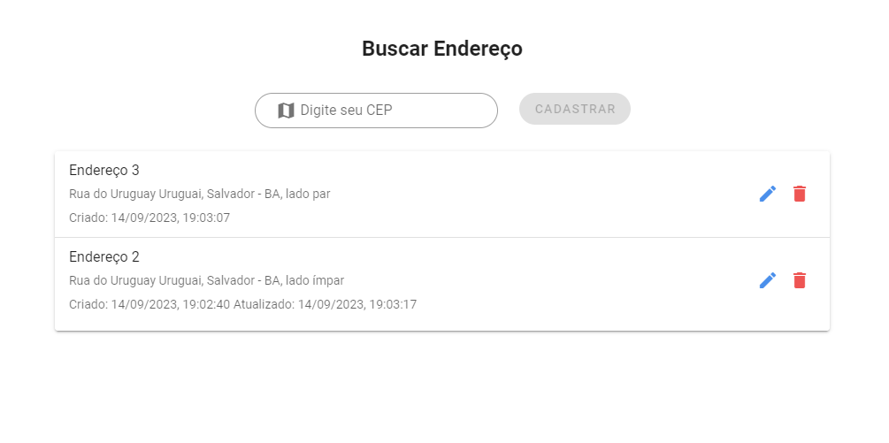

# Cadastro de endereço por CEP - Vue2 + Vuetify 




## Usage

```bash
$ git clone https://github.com/rogeriocode/address_registration.git
$ cd address_registration
$ yarn install
$ yarn serve
```

O aplicativo estará escutando na porta `8080`. Você pode visitar no URL `http://192.168.18.98:8080/`.

## Diretórios Especiais


### `views`

o diretório de view contém o padrão DDD

### `models`

o diretório de models contém as tipagens referentes ao modulo

### `routes`

o diretório de routes contém as rotas do modulo

### `services`

o diretório de services contém requisições com api, aqui está atrelado uma parte da regra de negócio

### `store`

o diretório de store contém as actions, mutations e state do módulo, de forma modular para ser importado ao store base da aplicação que fica em `src/store/modules.store.ts`

### `widgtes`

o diretório de widgets contém pequenos compontes, como campo de pesquisa, modal de endereço e listagem

### `/test/unit`

o diretório de test fora da views contém 2 exemplos de teste de unidade, das mutações e do service
